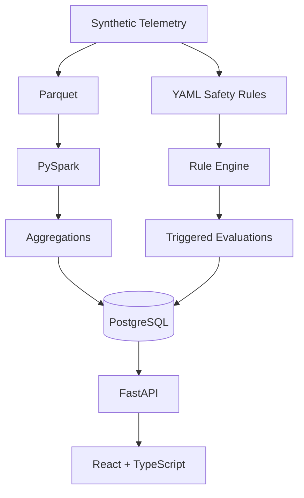

# SafeDrive

## Autonomous Vehicle Safety Analytics Platform

SafeDrive is a full-stack engineering platform for processing and investigating entirely synthetic autonomous-vehicle telemetry and safety events. It is an independent educational/portfolio project and is not affiliated with any autonomous-vehicle company.

## Overview

The project demonstrates an end-to-end analytics workflow: FastAPI and React backed by PostgreSQL, reproducible SQL performance analysis, a PySpark/Parquet batch pipeline, and a configuration-driven YAML safety-rule engine.

## Screenshots

Screenshots are intentionally not fabricated. See [`docs/images/README.md`](docs/images/README.md) for the four recommended captures: dashboard overview, safety evaluations, evaluation evidence, and Spark fleet summaries.

## Architecture



See [`docs/ARCHITECTURE.md`](docs/ARCHITECTURE.md) for component responsibilities and data flow.

## Key features

- Fleet, vehicle, route, telemetry, and safety-event analytics.
- PostgreSQL support with SQLite fallback for lightweight development and tests.
- Reproducible million-row synthetic telemetry generation and SQL `EXPLAIN ANALYZE` benchmarking.
- PySpark batch transformations, temporal window analysis, and Parquet summaries.
- YAML-configured safety rules with typed validation and explainable evidence.
- React investigation views for events and triggered rule evaluations.

## Tech stack

Python, FastAPI, SQLAlchemy, PostgreSQL 17, SQLite, pytest, PySpark, Parquet, React, TypeScript, Vite, Recharts, Docker Compose, and GitHub Actions.

## Safety analytics

The API exposes summary metrics, safety events, telemetry, Spark-derived summaries, configured rules, and persisted rule evaluations. Rule thresholds are illustrative and apply only to synthetic data; they are not autonomous-vehicle safety, regulatory, or industry requirements.

## PySpark telemetry pipeline

The optional local batch workflow reads raw Parquet, validates and enriches telemetry, computes vehicle-level window features, detects candidate conditions, and writes aggregate Parquet datasets. It does not replace PostgreSQL or load every raw row back into the API database. See [`docs/SPARK_PIPELINE.md`](docs/SPARK_PIPELINE.md).

## Safety rule engine

Rules live in `backend/config/safety_rules.yaml` and use a constrained field/operator whitelist—never executable Python expressions. Triggered evaluations are persisted with observed values and thresholds so an engineer can investigate why a record was flagged. See [`docs/SAFETY_RULE_ENGINE.md`](docs/SAFETY_RULE_ENGINE.md).

## PostgreSQL performance engineering

Phase 2 includes configurable synthetic data generation, reproducible query timing, PostgreSQL query plans, and evidence-based indexing. The measured environment, baseline, optimized results, and limitations are documented in [`docs/PERFORMANCE.md`](docs/PERFORMANCE.md); benchmark figures there are not changed by this polish work.

## Testing

Backend and rule-engine tests run with `pytest` from `backend`. The frontend uses TypeScript’s build check and Vite production build. Spark transformation tests are available locally and require Java/PySpark; CI intentionally runs the smaller core suite to keep hosted checks reliable.

## Local setup

```powershell
cd backend
py -m venv .venv
.\.venv\Scripts\Activate.ps1
pip install -r requirements.txt
python scripts/generate_data.py
uvicorn app.main:app --reload
```

In another terminal:

```powershell
cd frontend
npm install
npm run dev
```

For PostgreSQL, set `DATABASE_URL` before starting the backend, for example `postgresql+psycopg2://postgres@127.0.0.1:5432/safedrive` when using a local `pgpass.conf`, then run the generator. Do not commit `.env` or credential files.

## Docker setup

Install Docker Desktop, then:

```powershell
Copy-Item .env.docker.example .env
# Edit .env and set a local POSTGRES_PASSWORD.
docker compose up --build -d
docker compose run --rm backend python scripts/generate_data.py
```

Open `http://localhost:5173`. Stop services with `docker compose down`; add `-v` only when you intentionally want to remove the local Compose database volume. Spark remains a documented local workflow rather than a Compose service.

## Documentation

- [`docs/ARCHITECTURE.md`](docs/ARCHITECTURE.md)
- [`docs/PERFORMANCE.md`](docs/PERFORMANCE.md)
- [`docs/SPARK_PIPELINE.md`](docs/SPARK_PIPELINE.md)
- [`docs/SAFETY_RULE_ENGINE.md`](docs/SAFETY_RULE_ENGINE.md)

## Limitations

All telemetry and safety conditions are synthetic. This is an educational portfolio system, not a certified or production autonomous-vehicle safety platform. Local database, Spark, and benchmark results are environment-dependent and should not be interpreted as production performance or safety evidence.
