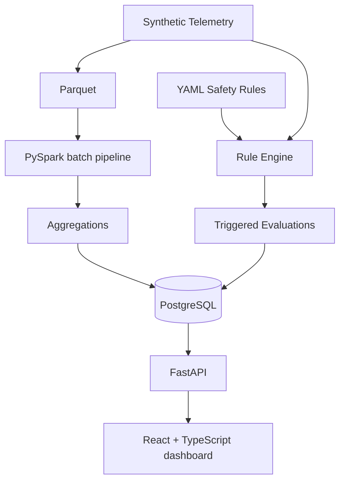

# SafeDrive Architecture

SafeDrive is an educational portfolio project that processes entirely synthetic telemetry. PostgreSQL is the primary application and benchmarking database; SQLite remains useful for lightweight development and tests.

## Components and data flow

- Synthetic generators create deterministic telemetry and safety-event data for development and analysis.
- PySpark reads raw Parquet, validates and enriches telemetry, performs vehicle-level window analysis, and writes processed and aggregate Parquet outputs. Selected summaries can be loaded into PostgreSQL.
- The YAML safety-rule engine validates a small whitelist-based rule format, evaluates telemetry without executable expressions, and records triggered evaluations with evidence.
- PostgreSQL stores application entities, Spark summaries, and rule evaluations. SQLite is the fallback used by lightweight tests.
- FastAPI exposes metrics, events, telemetry, Spark summaries, rules, and evaluation details.
- React + TypeScript presents the engineering dashboard and investigation views without replacing the underlying data-processing systems.

Spark is intentionally a separate local batch workflow; it is not required to run the core API and is not included in the application Compose services.
